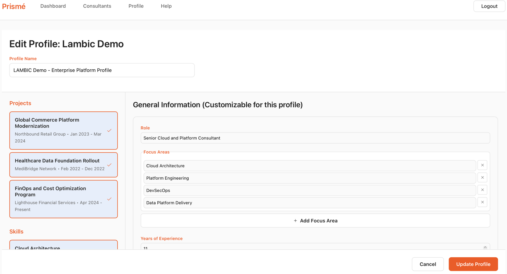
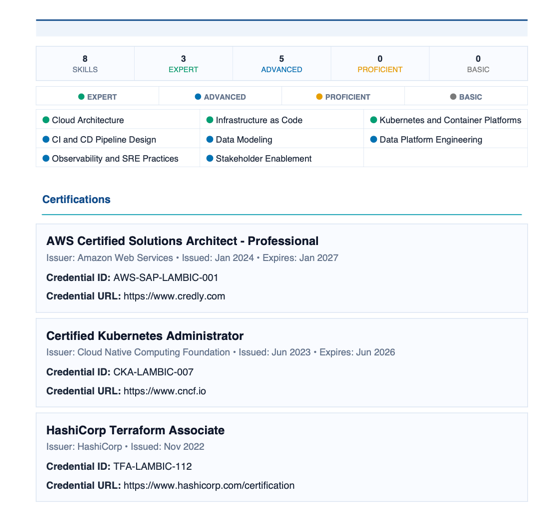

# Prismé

Prismé is an open-source consultant profile management app for teams that need to collect consultant experience, build profile variants quickly, and export polished PDF profiles.




------
## What It Does
- Manage consultants from an admin workspace
- Share temporary edit links with consultants (no consultant login required)
- Build reusable profile variants from modular blocks
- Export client-ready PDFs
- Install as a PWA for desktop/mobile app-like usage

## Quick Start

### Option 1: Docker
```bash
docker build -t prisme:latest .
docker run --name prisme -p 8000:8000 prisme:latest
```
Open `http://localhost:8000`.

### Option 2: Local Development
Backend:
```bash
cd backend
python -m venv .venv
source .venv/bin/activate
pip install -r requirements.txt
python run_init.py
uvicorn src.main:app --reload --host 0.0.0.0 --port 8000
```

Frontend:
```bash
cd frontend
npm install
npm run dev
```
Open `http://localhost:5173`.

## Small Tutorial
1. Sign in as admin.
2. Create a consultant in **Consultants**.
3. Generate an edit link and share it with the consultant.
4. Consultant updates projects/skills/certifications via the link.
5. Go to **Build Profile**, select blocks, and save a profile version.
6. Open **Profile History** and export PDF.

## Default Admin Login
- Username: `admin`
- Password: `admin123`

Change this password immediately after first login.

## License
MIT. See [LICENSE](LICENSE).
